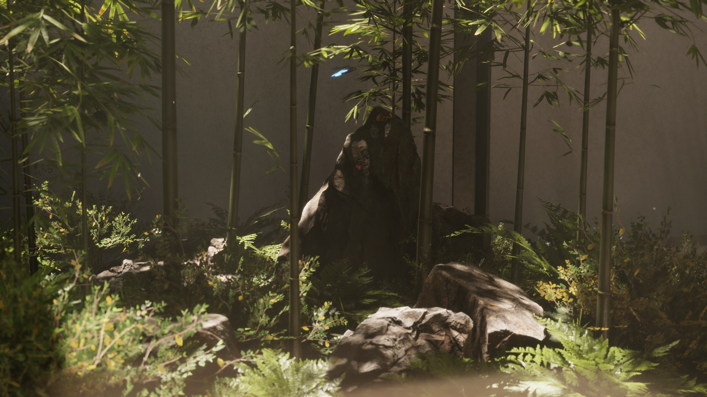

# HKUST GZ Photography

 For testing HDRP and other functions

## 功能概览

* 高清渲染管线
* Unity默认人物和移动系统——丝滑
* 第一和第三人称视角，实时切换——满足多视角的欣赏
* 多级画质可调，最高可到光线追踪级——压榨你的显卡
* Unity默认高质量建模初始场景预观赏——当作艺术去欣赏
* 高度还原的物理相机摄影调控系统，满足你的摄影学习需求和丰富的角度和灵感，在升级你的摄影设备前在虚拟世界中尽情尝试多种相机参数
* 视图实时拍照并保存——所见即刻所得
* 音频可视化——享受视听的叠加乐趣
* 自定义你的音乐歌单——指定你想听的音乐列表，进一步享受你的个人口味

|  |  |  |
| ---------------------------------------------- | ---------------------------------------------- | ---------------------------------------------- |
|  |  |  |
|  |  |  |
|  |  |  |

## 系统要求

* 操作系统：Windows10及以上
* 最低显卡：GTX1060
* 推荐显卡：RTX3060+
* 最低内存：8GB
* 键盘+鼠标

## 安装使用

1. 下载 : [**Releases · Lizhenghe-Chen/HKUST-GZ-Photography (github.com)**](https://github.com/Lizhenghe-Chen/HKUST-GZ-Photography/releases)。只需下载7z高压缩的文件
2. 解压。将文件解压在你期望的位置即可
3. 音乐文件夹（非必须），您可以准备一个文件夹来包含您想在应用内播放的音乐（支持的格式：MP3，wav，flac）以便后续使用

## 操作手册

### 基础操作

移动：`键盘WASD | 手柄（未完全支持）`
视角：`鼠标移动`
跳跃：`空格`
开启/关闭相机：  `键盘C`
开启/关闭菜单： `键盘ESC`
打开地图：`键盘M`

### 菜单

开启/关闭菜单：`键盘ESC`

可以随时更改画质

特定情况下可以使用地图瞬移按钮和返回home场景

### 自定义音频

内置了一个自己做的简单音乐播放组件（目前支持 .mp3 .wav .flac 格式)

默认有几首音乐放在了解压文件\\文件名_Data\Resources\DefaultMusic，你可以在改文件夹里面放入你想听的音乐文件
或者将你常听的外部音乐文件路径直接复制到应用内的地址栏并点击 `Load` 按钮尝试加载（两种方法不支持递归搜索，所以不要有子文件夹）

### 拍照（摄影参数讲解）

开启/关闭相机：`键盘C`

拍摄照片：`键盘Enter | UI‘TakePhoto’按钮`

在第一人称，即摄影模式下，你可以：

* Sensor Size-传感器大小：
  越大的传感器能够得到更好的景深虚化效果
  约小的传感器能够在相同焦长下得到更长的‘等效焦长’

  * `UI内手动调整`
* **Focus Length-焦长：**

  * `鼠标滚轮`：调节远近
  * `UI内手动调整`
* Apture-光圈：

  * `UI内手动调整`
* **Focus Distance-焦距/对焦：**

  * `单击鼠标右键`：在你想对焦的物体上单击鼠标右键尝试对**自动对焦**（如果该物体没有设置碰撞体，那么鼠标点击就会对焦失败，请使用手动对焦）
  * `按住鼠标右键+鼠标滚轮`：手动对焦
  * `UI内手动调整`
* Camera Rotation-相机旋转：

  * `UI内手动调整`

  ---

`UI自动曝光开关`：打开后下列选项将不可调整，自动完成平衡

* Shutter Speed-快门速度：

  * `UI内手动调整`
* ISO-感光度：

  * `UI内手动调整`

  ---
* 照片分辨率：
  将以当前屏幕分辨率为基数相乘，越大分辨率越高

  * `UI内手动调整`
